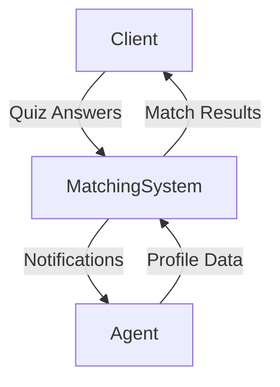

# Agent-Client Matching System Design

## 1. Overview
The Agent-Client Matching System is designed to intelligently pair clients with financial agents who best fit their needs, preferences, and goals. The system leverages structured agent profiles and a client intake quiz to generate high-quality matches, improving client satisfaction and agent engagement.

---

## 2. Matching Flow

### **A. Agent Onboarding & Profile Creation**
1. **Agent Registration:** Agents sign up and verify their identity.
2. **Profile Completion:** Agents fill out a detailed profile including:
   - Areas of expertise (e.g., retirement, investment, tax)
   - Years of experience
   - Certifications & licenses
   - Languages spoken
   - Preferred client types (e.g., young professionals, retirees)
   - Communication preferences (in-person, video, phone, digital)
   - Availability (days/times)
   - Location (if relevant)
   - Personal bio & photo
3. **Profile Review:** Admin reviews and approves agent profiles before they are eligible for matching.

### **B. Client Intake & Matching**
1. **Client Quiz:** Clients answer a series of questions about their financial goals, preferences, and situation.
2. **Matching Algorithm:** The system compares client answers to agent profiles using weighted criteria.
3. **Match Presentation:** The client is shown a shortlist of best-matched agents, including match scores and key profile info.
4. **Contact/Booking:** The client can contact or book a session with a matched agent.

---

## 3. Matching Criteria & Data Fields

### **A. Agent Profile Fields**
| Field                  | Type        | Description                                  |
|------------------------|-------------|----------------------------------------------|
| Name                   | String      | Full name                                    |
| Email                  | String      | Contact email                                |
| Phone                  | String      | Contact phone                                |
| Photo                  | Image URL   | Profile picture                              |
| Bio                    | Text        | Short professional biography                 |
| Areas of Expertise     | List        | E.g., Retirement, Investment, Tax, Insurance |
| Certifications         | List        | E.g., CFP, CFA, CPA                          |
| Years of Experience    | Number      | Years in practice                            |
| Languages              | List        | Languages spoken                             |
| Preferred Client Types | List        | E.g., Young professionals, Families          |
| Communication Modes    | List        | In-person, Video, Phone, Digital             |
| Availability           | Schedule    | Days/times available                         |
| Location               | String      | City/region (if relevant)                    |
| Status                 | Enum        | Pending, Approved, Active, Inactive          |

### **B. Client Intake Fields (Quiz)**
| Field                  | Type        | Example Values                               |
|------------------------|-------------|----------------------------------------------|
| Primary Goal           | Enum        | Retirement, Investment, Debt, Tax            |
| Investment Timeline    | Enum        | 1-3y, 3-10y, 10+y, Flexible                  |
| Risk Tolerance         | Enum        | Conservative, Moderate, Aggressive, Unsure   |
| Financial Situation    | Enum        | Beginner, Established, Advanced, Complex     |
| Communication Pref     | Enum        | In-person, Video, Phone, Digital             |
| Language Preference    | Enum/List   | English, Chinese, etc.                       |
| Location (optional)    | String      | City/region                                  |

---

## 4. Matching Algorithm (Example)
- Each quiz answer is mapped to agent profile fields.
- Assign weights to each criterion (e.g., goal match = 30%, communication = 20%, language = 20%, etc.).
- Calculate a match score for each agent.
- Return top N agents with the highest scores.

**Example:**
- Client wants "Retirement Planning" in Chinese, prefers video calls.
- Agent A: Retirement, speaks Chinese, offers video calls → 95% match
- Agent B: Investment, speaks English, offers phone only → 60% match

---

## 5. User Flows

### **A. Agent Flow**
1. Register & verify account
2. Complete profile (all required fields)
3. Submit for admin approval
4. Once approved, profile is active in the matching pool
5. Receive notifications when matched by clients
6. Manage profile and availability as needed

### **B. Client Flow**
1. Start matching quiz
2. Answer all questions
3. View matched agents (with scores and profiles)
4. Contact or book a session with an agent
5. Optionally, retake quiz or browse all agents

---

## 6. Extensibility & Future Improvements
- Add AI/ML to improve matching over time based on outcomes
- Allow agents to update availability in real-time
- Add client feedback to refine agent rankings
- Support for group/family matching
- Integration with scheduling and messaging tools
- Admin dashboard for monitoring matching analytics

---

## 7. Diagram: High-Level Flow

---

**This document provides a blueprint for building a robust, scalable agent-client matching system for financial services.** 